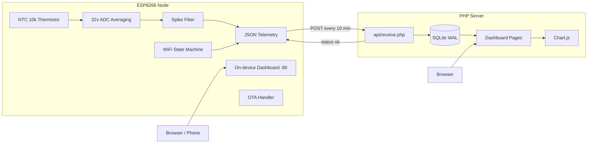

# 🌡️ ESP8266 Weather Station

**A self-hosted temperature monitoring system: an ESP8266 sensor node that reports to a bare-PHP + SQLite dashboard.**

Built for unattended 24/7 operation on a remote, occasionally-unstable WiFi link. The firmware is designed around one rule: *never need a human*. It reconnects, backs off, validates its own sensor readings, guards its own heap, and reboots itself when nothing else works.

[](https://github.com/esp8266/Arduino)
[](esp8266/esp8266.ino)
[](server/)
[](LICENSE)

---

## Contents

- [Overview](#overview)
- [Features](#features)
- [Architecture](#architecture)
- [Repository Structure](#repository-structure)
- [Hardware](#hardware)
- [Firmware Setup](#firmware-setup)
- [Server Setup](#server-setup)
- [Device Web Interface](#device-web-interface)
- [API](#api)
- [Reliability Design](#reliability-design)
- [Calibration](#calibration)
- [Security Notes](#security-notes)
- [Troubleshooting](#troubleshooting)
- [Roadmap](#roadmap)
- [License](#license)

---

## Overview

The system has two halves:

| Component | Stack | Location |
|---|---|---|
| **Sensor node** | ESP8266 + NTC 10k thermistor, Arduino C++ | [`esp8266/`](esp8266/) |
| **Server** | Bare PHP 7.4+, SQLite3, vanilla JS + Chart.js | [`server/`](server/) |

The node samples the thermistor every 2 seconds (32-sample averaged), and POSTs a JSON telemetry packet to the server every 10 minutes. The server stores it in SQLite and presents a WordPress-2020-style admin dashboard with charts, device health, and a raw reading log.

The node also hosts its **own** mini web dashboard at its IP address, so it remains fully diagnosable even if the server or internet is down.

## Features

### Firmware
- 🔁 **Non-blocking WiFi state machine** — OTA and the web UI stay alive during reconnects
- 📈 **Exponential backoff** — separate retry curves for WiFi (5 s → 15 min) and uploads (10 s → 15 min)
- 🧠 **Self-healing** — auto-reboot after 20 consecutive upload failures or when free heap drops below 8 KB
- ⏱️ **Scheduled 24 h reboot** — clears any accumulated state before it matters
- 🌡️ **32× ADC oversampling + spike rejection** — a single glitch reading (22 → 68 → 22 °C) is ignored unless it persists for 3 consecutive samples
- 💾 **Zero routine flash writes** — lifetime counters live in RTC memory, not EEPROM
- 📡 **OTA updates**, mDNS (`tempmonitor.local`), optional HTTPS with fingerprint pinning
- 🔌 **On-device dashboard** at `/` with live status, plus `/send`, `/temp`, `/reset`

### Server
- 📥 **Single ingest endpoint** (`api/receive.php`) with backward-compatible payload handling
- 🗄️ **SQLite storage** — zero configuration, one file, WAL mode for concurrency
- 📊 **Dashboard** — temperature/RSSI charts, device list, per-device detail with 7-day history
- 🚨 **Health page** — automatic alerts for offline devices, low heap, crash-loop reset reasons, reconnect storms
- 📜 **Reading log** with raw JSON payloads
- 🧹 **Retention cleanup** via `cron_cleanup.php` (default 90 days)

## Architecture



## Repository Structure

```
esp-weather-station/
├── esp8266/
│   └── esp8266.ino              # Complete firmware (single file)
│
├── server/
│   ├── api/
│   │   └── receive.php          # Telemetry ingest endpoint
│   ├── assets/
│   │   ├── css/admin.css        # WordPress-2020-style theme
│   │   └── js/charts.js         # Chart.js helpers
│   ├── data/                    # SQLite database lives here (git-ignored)
│   │   └── .htaccess            # Blocks direct DB download
│   ├── includes/
│   │   ├── config.php           # ← EDIT THIS
│   │   ├── db.php               # PDO + auto schema creation
│   │   ├── functions.php        # Formatting / status helpers
│   │   ├── header.php
│   │   ├── sidebar.php
│   │   └── footer.php
│   ├── index.php                # Dashboard
│   ├── devices.php              # Device list
│   ├── device.php               # Per-device detail + charts
│   ├── health.php               # Alerts
│   ├── log.php                  # Reading log
│   └── cron_cleanup.php         # Retention cleanup (CLI)
│
├── docs/
│   ├── API_DOCUMENTATION.md     # Payload schema + response contract
│   └── HARDWARE_SETUP.md        # Wiring guide
│
├── LICENSE
├── README.md
└── .gitignore
```

## Hardware

| Qty | Part | Notes |
|---|---|---|
| 1 | ESP8266 board | Wemos D1 Mini / NodeMCU / ESP-12 — 4 MB flash recommended |
| 1 | NTC thermistor | 10 kΩ @ 25 °C, B = 3425 |
| 1 | Resistor | 10 kΩ, 1% tolerance preferred |
| 1 | SSD1306 OLED *(optional)* | 128×64, I²C — disabled by default in firmware |
| – | Breadboard / wires / USB power | |

### Wiring

**Thermistor voltage divider** (thermistor high-side, resistor to ground):

```
3V3 ──┬── [ NTC 10k ] ──┬── A0
      │                 │
      │              [ 10k ]
      │                 │
GND ──┴─────────────────┴── GND
```

**Optional OLED (I²C):**

| OLED | ESP8266 |
|---|---|
| VCC | 3V3 |
| GND | GND |
| SDA | GPIO14 (D5) |
| SCL | GPIO12 (D6) |

Full assembly notes: [`docs/HARDWARE_SETUP.md`](docs/HARDWARE_SETUP.md)

## Firmware Setup

### 1. Install the toolchain

1. [Arduino IDE](https://www.arduino.cc/en/software)
2. ESP8266 board package — add to *Additional Boards Manager URLs*:
   ```
   http://arduino.esp8266.com/stable/package_esp8266com_index.json
   ```
   then install **esp8266 ≥ 3.0** from Boards Manager.
3. Libraries (Library Manager): **Adafruit GFX**, **Adafruit SSD1306** *(only needed if you enable the OLED)*.

### 2. Board settings

| Setting | Value |
|---|---|
| Board | LOLIN(WEMOS) D1 R2 & Mini *(or your board)* |
| CPU Frequency | 80 MHz |
| Flash Size | **4 MB (FS:1MB or FS:0)** — OTA needs headroom |
| Upload Speed | 115200 |

### 3. Configure

Open [`esp8266/esp8266.ino`](esp8266/esp8266.ino) and edit the top section:

```cpp
static const char WIFI_SSID_P[]     PROGMEM = "YourSSID";
static const char WIFI_PASSWORD_P[] PROGMEM = "YourPassword";

static const char SERVER_URL[] PROGMEM =
  "http://your-server/api/receive.php";
```

| Constant | Default | Meaning |
|---|---|---|
| `SEND_INTERVAL_BASE` | 10 min | Normal upload interval |
| `UPLOAD_RETRY_MAX` | 15 min | Backoff cap after failed uploads |
| `WIFI_RETRY_MAX` | 15 min | Backoff cap after failed connects |
| `MAX_CONSECUTIVE_FAILURES` | 20 | Reboots after this many failed uploads |
| `LOW_HEAP_THRESHOLD` | 8000 B | Reboots below this free heap |
| `ADC_SAMPLES` | 32 | Samples averaged per reading |
| `CAL_OFFSET` | −8.0 | Temperature calibration — see [Calibration](#calibration) |
| `DISPLAY_ENABLED` | 0 | Set 1 to enable the OLED |
| `USE_HTTPS` | 0 | Set 1 + fingerprint for TLS pinning |

### 4. Flash

Connect via USB → select port → **Upload**. First boot connects, then POSTs immediately.

## Server Setup

### Requirements

- PHP **≥ 7.4** with `pdo_sqlite`
- SQLite **≥ 3.24** (for `ON CONFLICT` upserts)
- Apache or Nginx

### 1. Deploy

Copy `server/` into your web root:

```bash
scp -r server/ user@your-server:/var/www/tempstation/
```

### 2. Permissions

The web server user must write to `data/`:

```bash
sudo chown -R www-data:www-data server/data
chmod 775 server/data
```

The database file is created automatically on first request.

### 3. Verify the database is protected

```bash
curl -I http://your-server/data/tempstation.sqlite3
# → must return 403, never 200
```

For stronger isolation, move the DB outside the web root in `includes/config.php`:

```php
const DB_FILE = '/var/lib/tempstation/tempstation.sqlite3';
```

### 4. Configuration — `includes/config.php`

| Constant | Default | Meaning |
|---|---|---|
| `APP_NAME` | `Temp Station` | Dashboard title |
| `DB_FILE` | `../data/tempstation.sqlite3` | SQLite path |
| `TIMEZONE` | `UTC` | Display timezone |
| `RETENTION_DAYS` | `90` | Readings older than this are purged |
| `DEVICE_KEY` | `''` *(off)* | Optional shared secret (`X-Device-Key` header) |

### 5. Retention cron (optional)

```bash
0 3 * * * php /var/www/tempstation/cron_cleanup.php
```

*(Cleanup also runs probabilistically inside `receive.php`, so this is optional.)*

### 6. Smoke test

```bash
curl -i -X POST http://your-server/api/receive.php \
  -H "Content-Type: application/json" \
  -d '{"temperature":21.45,"rssi":-61,"boot_count":1,"fails":0}'
# → HTTP 200  {"status":"ok","reading_id":1}
```

Open `http://your-server/` — the device should appear within one upload cycle.

## Device Web Interface

The node hosts its own dashboard at `http://<device-ip>/` (also `http://tempmonitor.local/` via mDNS):

| Endpoint | Purpose |
|---|---|
| `/` | Live status: temperature, heap, WiFi, upload stats, charts |
| `/send` | Trigger an immediate upload |
| `/temp` | Machine-readable JSON telemetry |
| `/reset` | Reboot the node |

## API

Full schema: [`docs/API_DOCUMENTATION.md`](docs/API_DOCUMENTATION.md)

### Current payload (schema v1)

```json
{
  "temperature": 21.45, "rssi": -61, "boot_count": 12, "fails": 0,
  "schema": 1, "device": "TempMonitor", "fw": "3.0.0",
  "chip_id": "DC8109", "mac": "EC:64:C9:DC:81:09", "ip": "10.1.1.11",
  "uptime_s": 86412, "temp_c": 21.45, "adc_raw": 512, "adc_samples": 32,
  "spike_rejects": 3, "channel": 6, "bssid": "F8:AA:3F:15:DD:E6",
  "wifi_state": "connected", "wifi_reconnects": 4,
  "consec_fails": 0, "total_uploads": 140, "ok_uploads": 139,
  "fail_uploads": 1, "ota_updates": 2,
  "heap": 40344, "heap_min": 40256,
  "reset_reason": "Software/System restart", "last_error": ""
}
```

Legacy payloads (`temperature`/`rssi`/`boot_count`/`fails` only) are still accepted.

### Response contract

The firmware validates the **body**, not just the status code:

| Server response | Firmware interprets as |
|---|---|
| `200` + body containing `ok` / `success` / empty body | ✅ Success |
| Body containing `error` | ❌ Failure → exponential backoff |

## Reliability Design

| Mechanism | What it prevents |
|---|---|
| Non-blocking WiFi state machine | Dead device during reconnects; OTA/web always reachable |
| Exponential backoff (WiFi + uploads) | Connection storms, hammering a down server |
| Reboot after 20 consecutive failures | Unrecoverable stuck states on an unattended device |
| Low-heap guard (8 KB) | Crashes from heap fragmentation |
| Scheduled 24 h reboot | Long-term drift of any kind |
| 32× ADC averaging | ESP8266 ADC noise (±3–5 LSB) |
| Spike persistence filter | Single-sample glitches corrupting data |
| RTC-memory counters | Flash wear — **zero** routine EEPROM writes |
| Watchdog feeding in all long ops | Hardware WDT resets during HTTP/OTA/ADC work |
| `millis()` unsigned-subtraction timing | Correct behavior across the 49.7-day overflow |

## Calibration

> ⚠️ **Known TODO:** the current `CAL_OFFSET = -8.0` is a rough empirical value and
> readings may run high (e.g., ~50 °C at room temperature). Validate against a real
> thermometer before trusting absolute values.

To recalibrate:

1. Place a reference thermometer next to the sensor; wait 10 minutes.
2. Read the raw value from the device dashboard: `raw = displayed − CAL_OFFSET`.
3. Set `CAL_OFFSET = real_temperature − raw` in the firmware and reflash.

If the error is very large (> 15 °C), first check that the series resistor is really
10 kΩ and that the thermistor isn't thermally coupled to the ESP8266 or its voltage
regulator (self-heating inside a sealed enclosure is a common cause).

## Security Notes

This project assumes a **trusted, isolated IoT network**. Be aware:

| Item | Status | Mitigation |
|---|---|---|
| OTA updates | **No password** (simplicity) | Keep the node on an isolated VLAN, or re-enable `setPasswordHash()` |
| Telemetry transport | Plain HTTP by default | Set `USE_HTTPS 1` + certificate fingerprint |
| Ingest endpoint | Open by default | Set `DEVICE_KEY` in `config.php` and send `X-Device-Key` from firmware |
| Device `/reset` | Unauthenticated | Network-level isolation |
| SQLite file | Protected by `.htaccess` (Apache) | Verify with `curl -I`; Nginx users must add a deny rule |

## Troubleshooting

| Symptom | Likely cause / fix |
|---|---|
| Node never appears on server | Check `SERVER_URL`; `curl` the endpoint manually; check server error log |
| `{"status":"error","message":"invalid json"}` | Firmware/server mismatch — compare payload with `docs/API_DOCUMENTATION.md` |
| Temperature reads ~50 °C at room temp | See [Calibration](#calibration); check for self-heating / wrong resistor |
| `database is locked` in PHP | WAL not active or `data/` on a network FS — use local disk |
| DB file downloadable via URL | `.htaccess` ignored (Nginx?) — add a deny rule or move DB outside web root |
| Compile error: IRAM 92% used | **Normal** — the WiFi stack reserves IRAM. Compiles and runs fine |
| Counters reset to 1 after power cut | Expected — RTC memory doesn't survive power loss (by design, to save flash) |
| Uploads fail with `transport -11` | Server/DNS timeout — check network; backoff will retry automatically |

## Roadmap

- [ ] Validate temperature calibration against reference thermometer
- [ ] Re-enable OTA password hash (or VLAN-only access)
- [ ] Optional daily EEPROM snapshot for power-loss-persistent statistics
- [ ] BME280 support (temperature + humidity + pressure)
- [ ] Deep-sleep battery variant
- [ ] Server-side alerting (email/webhook on offline devices)

## License

[MIT](LICENSE) — do whatever, no warranty. Built for my own shed; shared in case it helps yours.
```